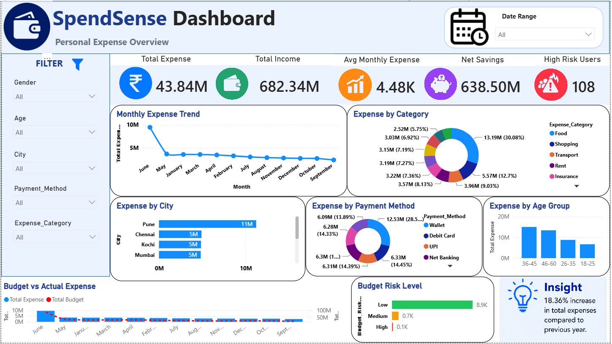

# 💰 SpendSense - Personal Expense Dashboard

A comprehensive Personal Expense Analysis project developed using Python, Pandas, MySQL, Power BI, Power Query, and DAX. The project helps analyze personal income, expenses, savings, budget utilization, and financial risk levels through interactive dashboards and insightful visualizations.

## 📌 Project Overview

This project provides a detailed analysis of personal financial transactions using Python, SQL, and Power BI. It enables users to track spending patterns, monitor savings, evaluate budget performance, and identify financial risks through interactive reports and KPI-driven dashboards.

The project demonstrates:

- 🧹 Data Cleaning
- 🔄 Data Preprocessing
- 📊 Exploratory Data Analysis (EDA)
- 🗄 SQL Analysis
- 📈 Data Visualization
- ⚙️ Data Modeling
- 📉 Power BI Dashboard Development

---

## ✨ Features

- 💸 Total Expense Analysis
- 💰 Total Income Tracking
- 🏦 Net Savings Calculation
- 📅 Average Monthly Expense Monitoring
- ⚠️ High Risk User Identification
- 📈 Monthly Expense Trend Analysis
- 🍔 Expense Category Analysis
- 🏙 Expense by City Analysis
- 💳 Payment Method Analysis
- 👥 Age Group Spending Analysis
- 📊 Budget vs Actual Expense Comparison
- 🚨 Budget Risk Level Assessment
- 🎛 Interactive Filters & Slicers
- 📌 Dynamic KPI Cards

---

## 🛠 Technologies Used

- Python
- Pandas
- NumPy
- MySQL
- Power BI Desktop
- Power Query
- DAX (Data Analysis Expressions)
- Jupyter Notebook
- CSV Dataset

---

## 🗂 Dataset

The project is built using a personal expense dataset containing income, expenses, savings, budget allocation, risk levels, and customer demographic information.

### Dataset Includes

- User Information
- Age
- Gender
- Occupation
- City
- Monthly Income
- Expense Amount
- Expense Category
- Payment Method
- Budget Allocated
- Estimated Savings
- Budget Risk Level
- Credit Score
- Merchant Details
- Transaction Date
- User Rating
- Recurring Expense Information

### 📂 Dataset Location

```text
SpendSense_Cleaned.csv
```

---

## 🖥 Dashboard Preview

### 📊 Main Dashboard




---

## 📊 Business Insights

- Analyzed monthly spending trends across different periods.
- Compared actual expenses with allocated budgets.
- Identified high-risk users based on spending behavior.
- Evaluated category-wise expense distribution.
- Analyzed city-wise spending patterns.
- Examined payment method preferences.
- Measured savings performance against income.
- Monitored budget utilization and financial risk levels.

---

## 📁 Project Structure

```text
SpendSense-Personal-Expense-Dashboard/
│
├── SpendSense.pbix
├── SpendSense.ipynb
├── SpendSenseDB.sql
├── SpendSense_Cleaned.csv
├── SpendSense Dashboard.PNG
├── README.md
└── LICENSE
```

---

## 🚀 How to Use

1. Clone or download this repository.
2. Open `SpendSense.ipynb` in Jupyter Notebook.
3. Run the notebook for data cleaning and analysis.
4. Import the dataset into MySQL.
5. Execute `SpendSenseDB.sql`.
6. Open `SpendSense.pbix` using Power BI Desktop.
7. Refresh the data source if required.
8. Explore the interactive dashboard.

---

## 🎯 Skills Demonstrated

- Data Cleaning
- Data Preprocessing
- Exploratory Data Analysis (EDA)
- SQL Query Writing
- Data Transformation
- Data Modeling
- Power Query
- DAX Calculations
- Business Intelligence
- Financial Analytics
- Dashboard Design
- Data Visualization
- KPI Development

---

## 📈 Key Performance Indicators (KPIs)

- Total Expense
- Total Income
- Net Savings
- Average Monthly Expense
- High Risk Users
- Budget Utilization
- Expense Growth Rate
- Savings Performance

---

## 👨‍💻 Author

**Bijoe Shane**

Aspiring Data Analyst | Power BI | SQL | Python | Excel

GitHub: https://github.com/bijoe-byte

---

## 📄 License

This project is licensed under the MIT License.
